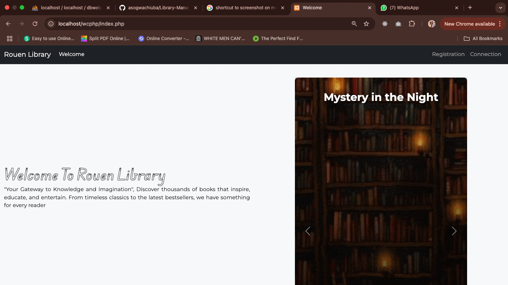

# 📚 Library Management System

A web-based **Library Management System** designed for schools to make borrowing books **easy, fast, and paperless** for students, while giving admins powerful tools to manage books, users, and track library activity.

---

## 🎯 Purpose

This project streamlines the library experience:

- **For Students** — Search and borrow books online, then simply collect them from the library without lengthy paperwork.
- **For Admins** — Easily manage books, users, and view insightful analytics of student borrowing activities.

---

## ✨ Features

### 👩‍🎓 Student
- Browse available books
- Borrow books online
- View borrowed and returned books history

### 🛠️ Admin
- Add, edit, and remove books
- Manage student accounts
- Track borrowing/return history
- Generate and view usage statistics
- Analyze return rates and book popularity

---

## 🖼️ Project Demo

### 🔹 Onboarding

### 🔹 Student Dashboard

### 🔹 Admin Dashboard

---

## 🏗️ Tech Stack

- **Frontend:** HTML, CSS, JavaScript (Bootstrap for UI components)
- **Backend:** PHP
- **Database:** MySQL
- **Charts & Stats:** Chart.js
- **Styling:** Custom CSS + Bootstrap

---

